# AIOT組別3's New Homework #5 (in HsuHsingYu/aiot_hw5)

## Lecture 14: IoT Flask Web (github, vs code)

## Step 1 : Development Environment Setup in aiot_hw5 (前置作業)
### 1. Please install vs code, register github, install git for windows
 
* 而vscode中需要安裝好此次作業所需的python相關模組，另外也需要去python官網下載相關的內容

### 2. 操作 check point 1
*  我們需要建立一個資料夾，點擊下圖紅框區域輸入”cmd”來開啟終端機
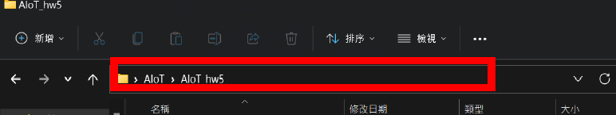
在裡面輸入 git clone https://github.com/huanchen1107/aiot0524.git
將老師上課所提供的gitHub內容抓下來
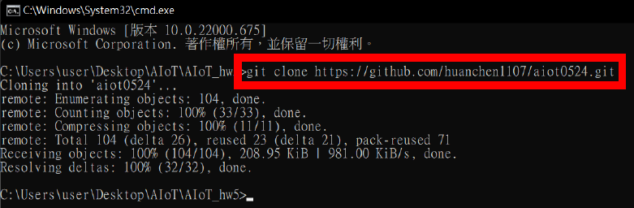

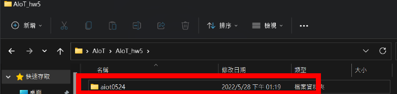
* 然後再開一個資料夾，將0524中的Readme.MD抓過來，此為接下來主要作業的地方
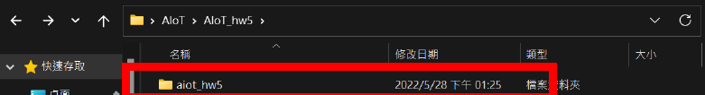
* 建立在github中的repository
  * 將剛剛建立好的資料夾利用vscode開啟
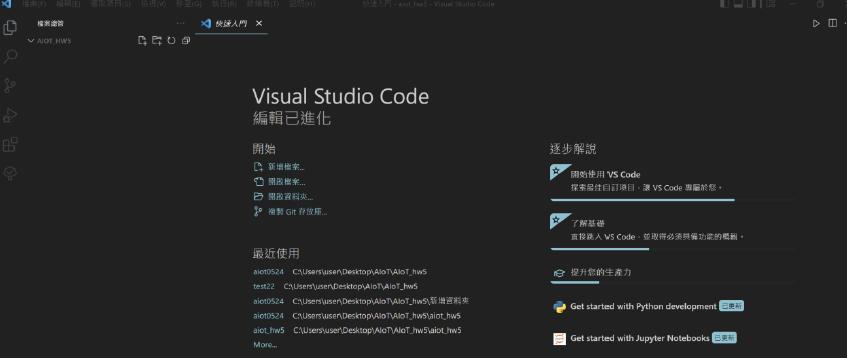
* 點擊紅框，並選擇發布到gitHub
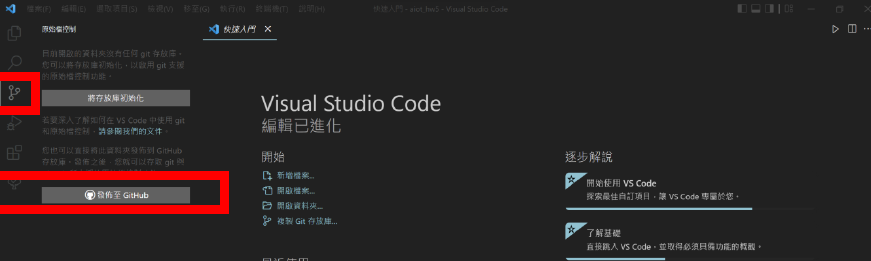
* 選擇public的
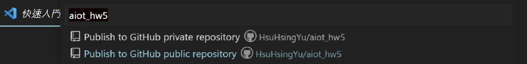
* 發布成功
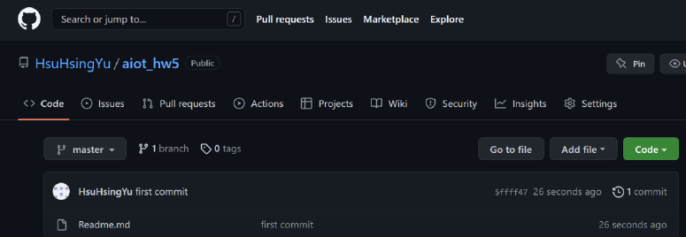

### 3. 操作 check point 2
C:> 設定下面 (不設定 branch default ='main')
   * C:> git config --global user.name "HsuHsingYu"
   * C:> git config --global user.email s108056052@smail.nchu.edu.tw

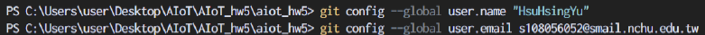  

### STEP2 simple flask web
1. 使用vscode開啟aiot0524的資料夾，並簽出至step2  
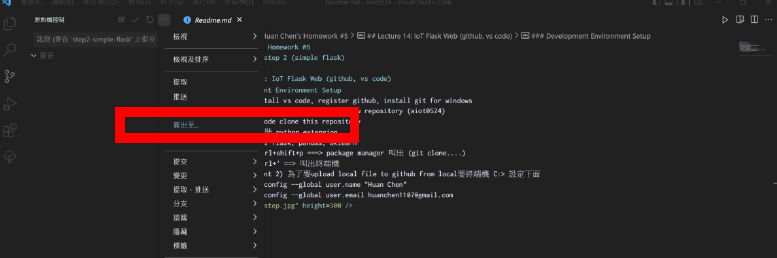

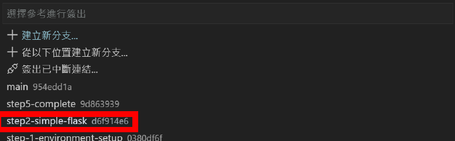  
完成後可以看到aiot資料夾的變化  

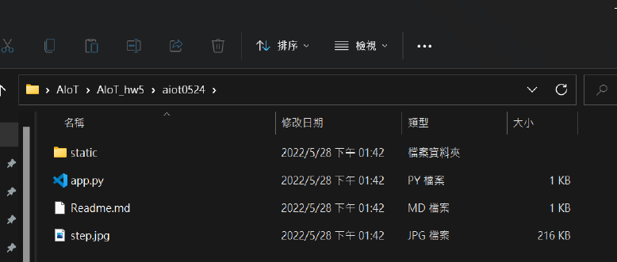  
2. 在aiot_hw5下面建立step2的分支(p.s step1分支內容為將readme改為我們的資料後)  

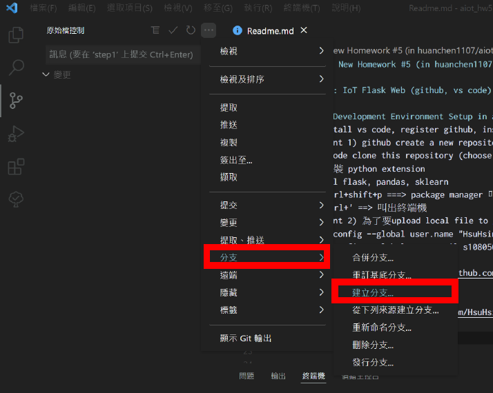  

* 完成內容請見step2
### STEP3 app.py NoAI.html (有highchart)
* 完成內容請見step3
### STEP4 Logistic regression (有db互動)
* 完成內容請見step4
### STEP5 complete
* 完成內容請見step5

