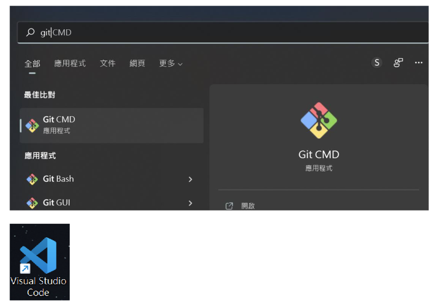
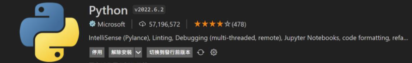
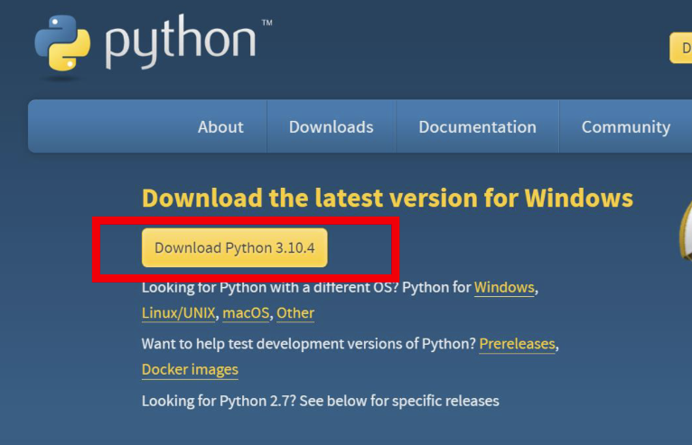

# AIOT組別3's New Homework #5 (in HsuHsingYu/aiot_hw5)

## Lecture 14: IoT Flask Web (github, vs code)

### Step 1 : Development Environment Setup in aiot_hw5 (前置作業)
1. Please install vs code, register github, install git for windows
 
* 而vscode中需要安裝好此次作業所需的python相關模組，另外也需要去python官網下載相關的內容

2. (check-point 1) github create a new repository (aiot0524)
3. go to vs code clone this repository (choose new branch) 
4. vs code 安裝 python extension 
5. pip install flask, pandas, sklearn 
  * 快捷鍵 ctrl+shift+p ===> package manager 叫出 (git clone....)
  * 快捷鍵 ctrl+' ==> 叫出終端機 
6. (check-point 2) 為了要upload local file to github from local要終端機 C:> 設定下面 (不設定 branch default ='main')
   * C:> git config --global user.name "HsuHsingYu"
   * C:> git config --global user.email s108056052@smail.nchu.edu.tw
   
7. C:> git remote add origin https://github.com/huanchen1107/aiot_0524.git 

if you want to change
git remote add origin https://github.com/HsuHsingYu/aiot_hw5.git
git branch -M main
git push -u origin main

### STEP2 simple flask web
* 完成內容請見step2
### STEP3 app.py NoAI.html (有highchart)
* 完成內容請見step3
### STEP4 Logistic regression (有db互動)
* 完成內容請見step4
### STEP5 complete
* 完成內容請見step5

